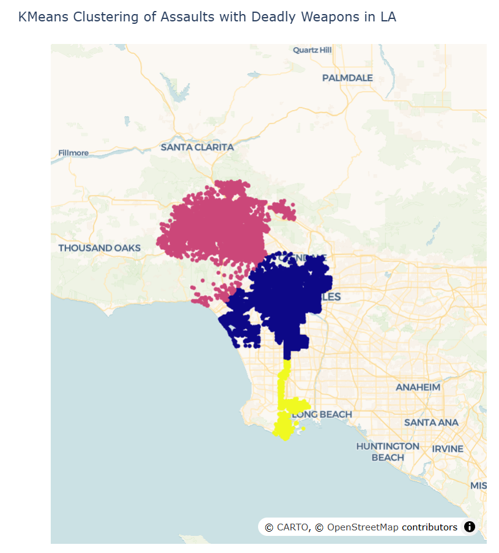
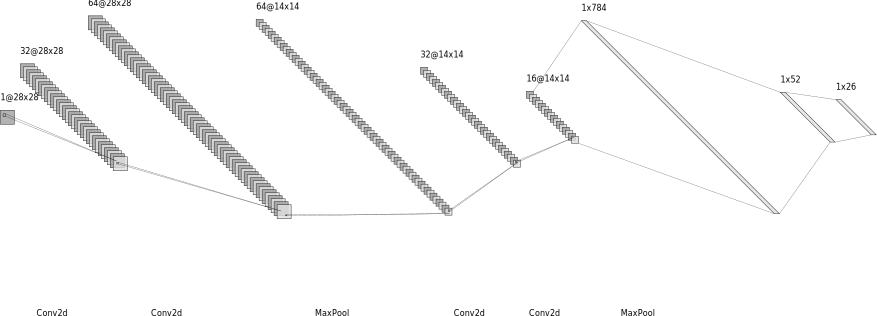

# Machine Learning Notebook
Compilation of projects from MSCS 335 - Machine Learning at the University of Wisconsin - Stout.

Each project has its own directory with the files necesary to run it. Most datasets are not included in the repository, but links to them are provided in the README files. Some of the notebook entries have not been cleaned up, but they are still functional.

## 5. Decision Trees and Random Forest Classification

Link to the entry: [src/5_decision_trees_random_forest](src/5_decision_trees_random_forest)

For this project we implemented Decision Trees for classification of the [Obesity Levels dataset](https://www.kaggle.com/datasets/fatemehmehrparvar/obesity-levels). We also compared the performance of Random Forest and SVC classifiers. We used the [Magic Gamma Telescope dataset](https://archive.ics.uci.edu/dataset/159/magic+gamma+telescope) from UCI ML repository. Finally we implemented a simple Gini impurity calculator.

## 6. Bagging Classifiers and Random Forest Classifiers

Link to the entry: [src/6_random_forest_and_bagging_classifiers](src/6_random_forest_and_bagging_classifiers)

In this assignments, we compared the performance of a bagging classifier with a linear SVC and a random forest classifier on the [Fashion MNIST dataset](https://www.kaggle.com/datasets/zalando-research/fashionmnist). We also plotted the feature importances of the random forest classifier. Both methods achieved similar accuracy on the test set at around 79%. 

## 7. K-Means Clustering

Link to the entry: [src/7_kmeans](src/7_kmeans)

For this project, we implemented K-Means to get crime clusters in the city of Los Angeles. The dataset used is the [LA Crime data from 2020 to present](https://catalog.data.gov/dataset/crime-data-from-2020-to-present). Since the dataset is too large, only assault with deadly weapon was clustered. 3 clusters were selected using the elbow method. Results are shown below.

## 8. ANN and CNN

Link to the entry: [src/8_ann_and_cnn](src/8_ann_and_cnn)

In this assignment, we used a simple CNN on the [EMNIST Dataset](https://www.kaggle.com/datasets/crawford/emnist) to classify written letters (Uppercase and Lowercase). The architecture of the NN is shown below.

