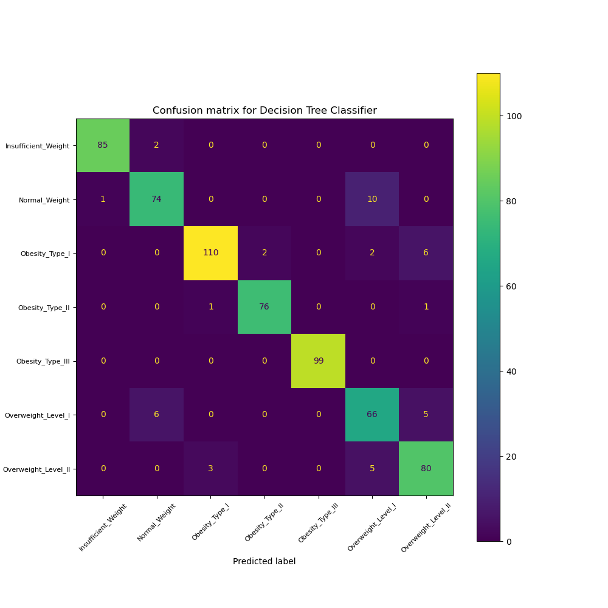
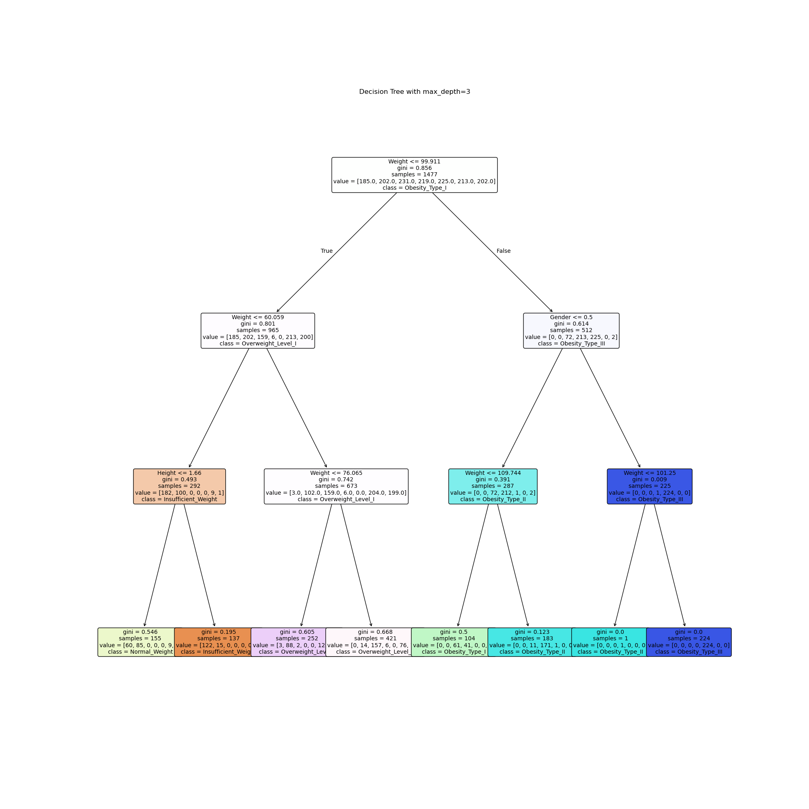
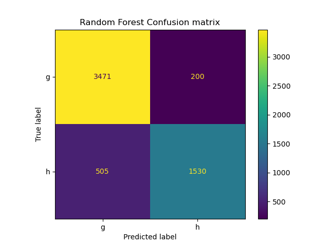
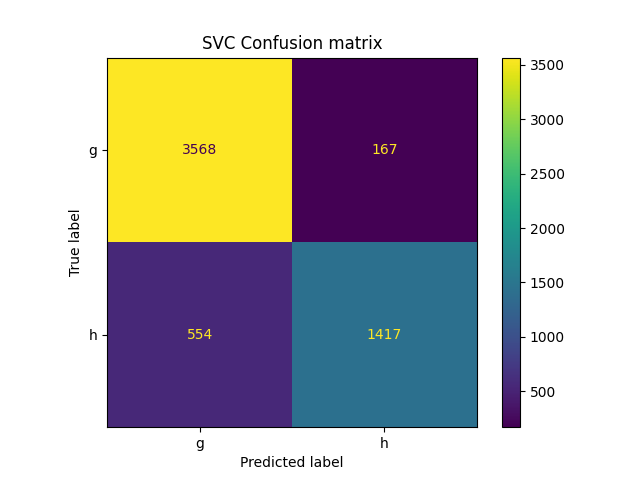

# Notebook Check 5. Decision Trees and Random Forest Classification

## Decision Trees

For this project, we implemented Decision Trees for classification of the [Obesity Levels dataset](https://www.kaggle.com/datasets/fatemehmehrparvar/obesity-levels). As per the website, the dataset contains 2111 samples with 17 features. The dataset label is a categorical variable with the following classes: Insufficient Weight, Normal Weight, Overweight Level I, Overweight Level II, Obesity Type I, Obesity Type II and Obesity Type III.

As a first step we did a grid search to find the optimal depth of the tree (`max_depth_cv.py`). The optimal depth was found to be 12, with a test accuracy of 0.91. The tree was very effective predicting obesity levels. Confusion matrix shown below.

We also plotted a 3-depth tree to visualize the decision boundaries. The plot is shown below.

## Random Forest and SVC

We also compared the performance of Random Forest and SVC classifiers. We used the [Magic Gamma Telescope dataset](https://archive.ics.uci.edu/dataset/159/magic+gamma+telescope) from UCI ML repository. We performed a grid search to find the optimal hyperparameters for both classifiers. Results are displayed in the `CV_results.txt` file. Confusion matrices for both classifiers are shown below.

Both classifiers perfomed about the same, topping at around 0.87 accuracy. However, finding the optimal hyperparameters for SVC took a lot longer than for Random Forest. Predictions for SVC were also slower than for Random Forest. 

## Gini Calculator

A simple Gini impurity calculator was implemented in `gini_calculator.py`. It takes a list of labels and returns the Gini impurity. 