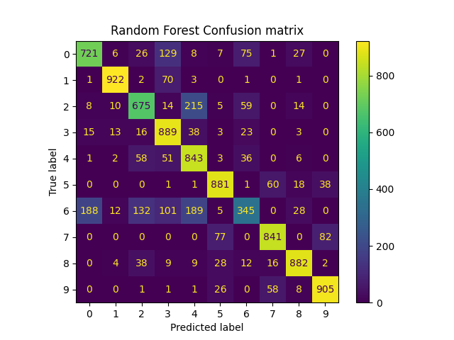
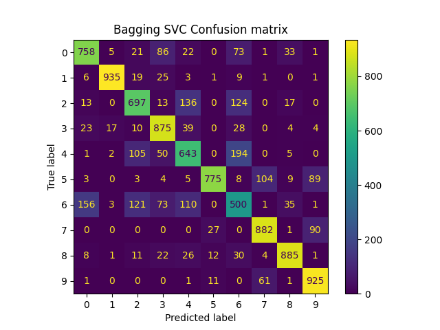
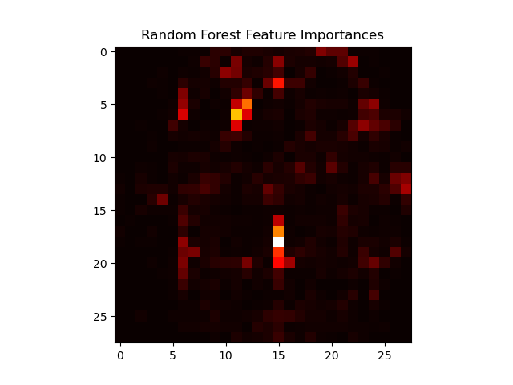

# Notebook Check 6. Bagging Classifiers and Random Forest Classifiers

In this assignments, we used a bagging classifier with a linear SVC and a random forest classifier on the [Fashion MNIST dataset](https://www.kaggle.com/datasets/zalando-research/fashionmnist). The dataset contains 70,000 images of clothing items, each with 28x28 pixels. The

Both classifiers achieved similar accuracy on the test set at around 79%. Results can be found in the `rf_results.csv` and `bagging_svc_results.csv` files. Confusion matricies are shown below.

Feature importances were also calculated for the random forest classifier. A heatmap of the feature importances is shown below.

While the importances are not very informative, they do show that most of the information is coming from the center of the image, and not so much the corners. This is expected, as the center is where the clothing is most likely to be located. 