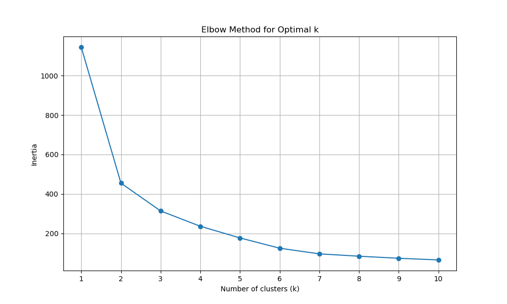

# Notebook Check 7. K-Means clustering

For this project, we implemented KMeans clustering to get crime clusters in the city of Los Angeles. The dataset used is the [LA Crime data from 2020 to present](https://catalog.data.gov/dataset/crime-data-from-2020-to-present). Since the dataset is too large, only assault with deadly weapon was clustered. 3 clusters were selected using the elbow method. The following are the were the following:

The Kmeans results are shown below

Clusters show LA suburbs (red), central LA (blue) and South LA (yellow). The blue cluster is substantially more desnse than the other two clusters, which makes sense since it constains the downtown area. Focusing on such a large area may not have been a very a good idea, since it makes the clustering less useful and less insightful. Analysis of smaller areas, like downtown LA, may produce more useful results. 
