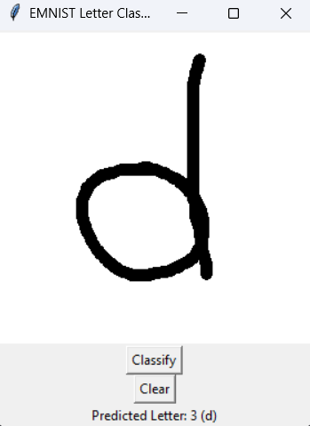

# Notebook Check 8. ANN and CNN

In this assignment, we used a simple CNN on the [EMNIST Dataset](https://www.kaggle.com/datasets/crawford/emnist) to classify written letters (Uppercase and Lowercase).

The architecture of the CNN includes four convolutional layers, two max pooling layers, and two fully connected layers. The model was trained for 10 epochs with a batch size of 16, and achieved a test accuracy of 0.92. Model weights were saved to `model.pth` file. Better accuracy could be achieved by training for more epochs and tuning the hyperparameters.

In the `emnist_draw_classifier.py` file, you can draw a letter and the model will predict it. However, the model is not very accurate for letters that are not in the training or test set. It probably has something to do with the fact that letters are perfectly cropped and centered in the dataset, while in the drawing app they are not. Better results can be achieved by writing letters in the center of the canvas. The app is shown below. 

